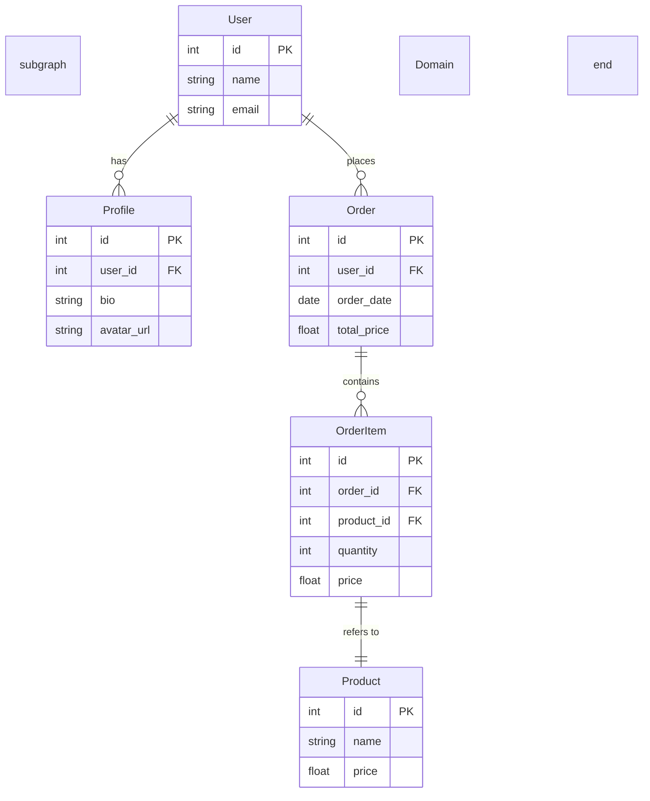

```mermaid
erDiagram
    %% User 도메인 그룹
    subgraph User Domain
        User {
            int id PK
            string name
            string email
        }
        Profile {
            int id PK
            int user_id FK
            string bio
            string avatar_url
        }
    end

    %% Order 도메인 그룹
    subgraph Order Domain
        Order {
            int id PK
            int user_id FK
            date order_date
            float total_price
        }
        OrderItem {
            int id PK
            int order_id FK
            int product_id FK
            int quantity
            float price
        }
    end

    %% Product 도메인 그룹
    subgraph Product Domain
        Product {
            int id PK
            string name
            float price
        }
    end

    %% 테이블 간 관계 정의
    User ||--o{ Profile : "has"
    User ||--o{ Order : "places"
    Order ||--o{ OrderItem : "contains"
    OrderItem ||--|| Product : "refers to"
```
